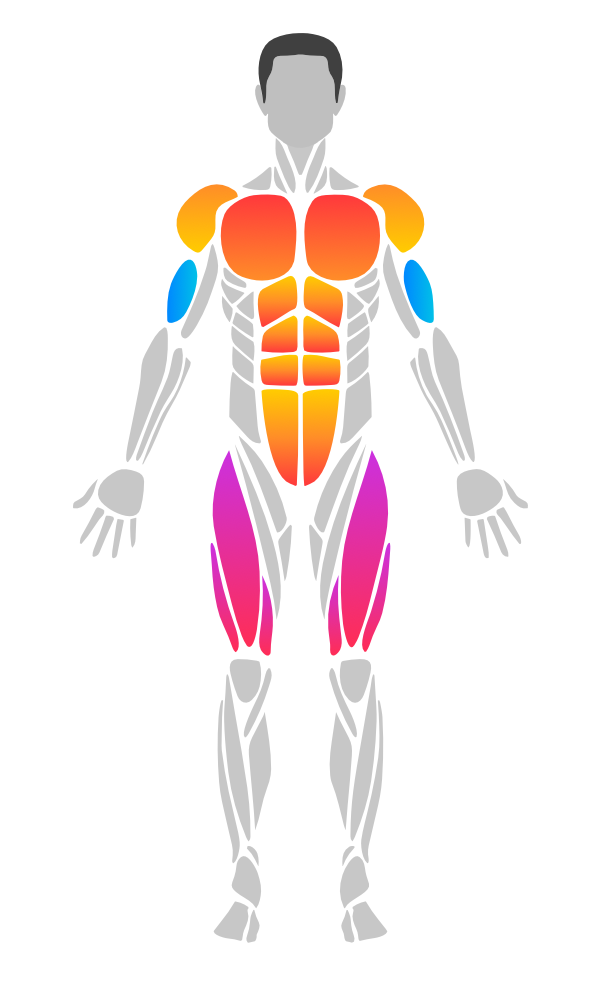
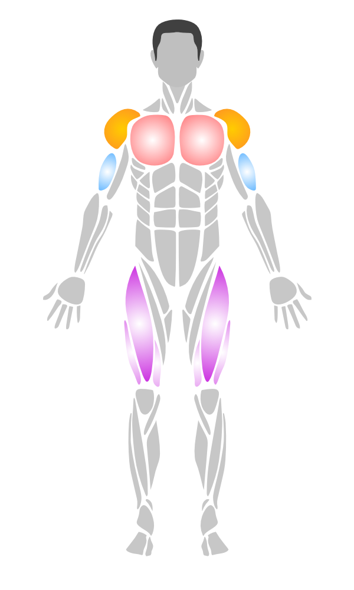
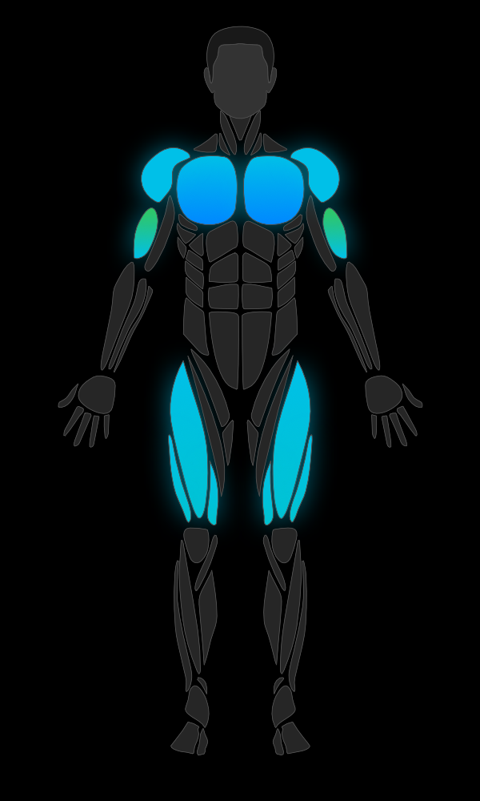
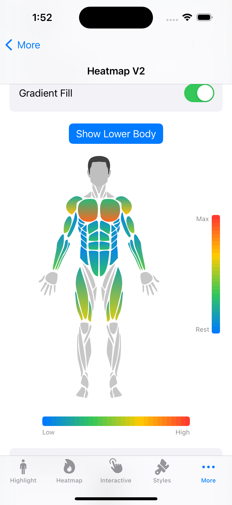
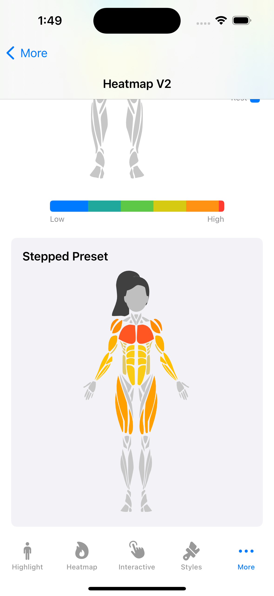
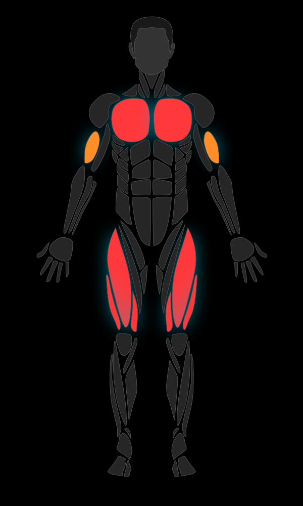

# MuscleMap

A native SwiftUI SDK for rendering interactive human body muscle maps with highlighting, heatmaps, multi-select, zoom, and gesture-rich interaction.

Supports **male & female** body models with **front & back** views.

<p align="center">
  
  
  
  
</p>

## Features

- SVG-based body rendering via SwiftUI `Canvas`
- **36 muscle groups** (22 base + 4 new muscles + 10 sub-groups) with left/right side detection
- **Muscle sub-groups** with parent/child inheritance and priority hit testing
- Heatmap visualization with customizable color scales
- Tap-to-select with hit testing
- **Multi-select** (select multiple muscles at once)
- **Long press gesture** (with configurable duration)
- **Drag-to-select** (paint muscles by dragging)
- **Pinch-to-zoom & pan** (with double-tap to reset)
- **Tooltips** (custom content positioned above selected muscles)
- **Undo/redo** (selection history tracking)
- 4 preset styles (default, minimal, neon, medical)
- **Gradient fills** (linear & radial gradients)
- **Transition animations** (fade in/out on highlight changes)
- **Pulse/glow animation** (for selected muscles)
- **Shadow/drop shadow** support
- **Accessibility** (VoiceOver support with localized muscle names)
- **Localization** (11 languages: EN, TR, DE, ES, FR, JA, ZH, KO, AR, PT-BR, RU)
- Zero external dependencies
- iOS 17+ / macOS 14+

## Installation

### Swift Package Manager

Add to your `Package.swift`:

```swift
dependencies: [
    .package(url: "https://github.com/melihcolpan/MuscleMap.git", from: "1.5.0")
]
```

Or in Xcode: **File > Add Package Dependencies** and paste the repository URL.

## Quick Start

```swift
import SwiftUI
import MuscleMap

struct ContentView: View {
    var body: some View {
        BodyView(gender: .male, side: .front)
            .highlight(.chest, color: .red)
            .highlight(.biceps, color: .orange, opacity: 0.8)
            .frame(height: 400)
    }
}
```

## Usage

### Basic Highlighting

```swift
BodyView(gender: .male, side: .front)
    .highlight(.chest, color: .red)
    .highlight(.abs, color: .yellow, opacity: 0.6)
    .highlight([.quadriceps, .calves], color: .orange)
```

### Gradient Highlighting

<p align="center">
  
  
  
</p>

```swift
// Linear gradient (top to bottom)
BodyView(gender: .male, side: .front)
    .highlight(.chest, linearGradient: [.red, .orange], startPoint: .top, endPoint: .bottom)

// Radial gradient (center outward)
    .highlight(.biceps, radialGradient: [.white, .blue], center: .center, endRadius: 40)

// Mix gradients and solid colors
    .highlight(.quadriceps, color: .purple)
```

### Tap Detection

```swift
BodyView(gender: .female, side: .front)
    .onMuscleSelected { muscle, side in
        print("\(muscle.displayName) (\(side))")
    }
```

### Heatmap

<p align="center">
  
  
</p>

```swift
// Integer scale (0-4, like workout trackers)
BodyView(gender: .male, side: .front)
    .intensities([
        .chest: 3,
        .biceps: 2,
        .quadriceps: 4,
        .abs: 1
    ])

// Custom intensity data (0.0 - 1.0)
let data = [
    MuscleIntensity(muscle: .chest, intensity: 0.8),
    MuscleIntensity(muscle: .biceps, intensity: 0.5, side: .left),
    MuscleIntensity(muscle: .abs, intensity: 0.3, color: .purple)
]
BodyView(gender: .male, side: .front)
    .heatmap(data, colorScale: .thermal)
```

### Color Scales

| Scale | Colors |
|-------|--------|
| `.workout` | gray -> yellow -> orange -> red |
| `.thermal` | blue -> green -> yellow -> red |
| `.medical` | green -> yellow -> red |
| `.monochrome` | light gray -> dark |
| `.workoutStepped` | workout with 5 discrete steps |
| `.thermalSmooth` | thermal with ease-in-out curve |

Custom:
```swift
let custom = HeatmapColorScale(colors: [.blue, .purple, .pink])
```

### Color Interpolation

Control how intensity values map to colors across the scale:

```swift
// Ease-in-out for smoother transitions
BodyView(gender: .male, side: .front)
    .heatmap(data, colorScale: .thermal)
    .heatmapInterpolation(.easeInOut)

// Stepped (discrete levels)
BodyView(gender: .male, side: .front)
    .heatmap(data, colorScale: .workoutStepped)  // built-in 5-step preset

// Custom curve
.heatmapInterpolation(.custom { t in t * t * t })
```

Available interpolations: `.linear`, `.easeIn`, `.easeOut`, `.easeInOut`, `.step(count:)`, `.custom()`

### Heatmap Threshold

Hide muscles below a minimum intensity:

```swift
BodyView(gender: .male, side: .front)
    .heatmap(data)
    .heatmapThreshold(0.2)  // muscles with intensity < 0.2 are hidden
```

### Gradient Heatmap Fill

<p align="center">
  
  
</p>

Apply intra-muscle gradients based on intensity (low-to-high color within each muscle):

```swift
BodyView(gender: .male, side: .front)
    .heatmap(data, colorScale: .thermal)
    .heatmapGradient(direction: .topToBottom, lowFactor: 0.3)
```

Directions: `.topToBottom`, `.bottomToTop`, `.leftToRight`, `.rightToLeft`

### Heatmap Configuration

Combine all heatmap settings in a single configuration:

```swift
let config = HeatmapConfiguration(
    colorScale: .thermal,
    interpolation: .easeInOut,
    threshold: 0.2,
    isGradientFillEnabled: true,
    gradientDirection: .topToBottom,
    gradientLowIntensityFactor: 0.3
)

BodyView(gender: .male, side: .front)
    .heatmap(data, configuration: config)
```

### Heatmap Legend

Display a color bar legend alongside the body view:

```swift
// Horizontal legend
HeatmapLegendView(colorScale: .workout)
    .frame(width: 200)

// Vertical legend with custom labels
HeatmapLegendView(
    colorScale: .thermal,
    interpolation: .easeInOut,
    orientation: .vertical,
    barThickness: 20,
    labelMin: "Rest",
    labelMax: "Max"
)
.frame(width: 60, height: 200)
```

### Animated Heatmap Transitions

When using `.animated()`, color transitions between heatmap states are now smoothly interpolated:

```swift
BodyView(gender: .male, side: .front)
    .heatmap(currentData, colorScale: .thermal)
    .animated(duration: 0.5)
```

### Styles

<p align="center">
  
  
</p>

```swift
BodyView(gender: .male, side: .front)
    .bodyStyle(.neon)
```

| Style | Description |
|-------|-------------|
| `.default` | Gray fill, green selection |
| `.minimal` | Subtle fill, thin strokes |
| `.neon` | Dark background, cyan selection, glow shadow |
| `.medical` | Clinical blue-gray tones |

Custom:
```swift
let style = BodyViewStyle(
    defaultFillColor: .gray,
    strokeColor: .white,
    strokeWidth: 1,
    selectionColor: .yellow,
    selectionStrokeColor: .yellow,
    selectionStrokeWidth: 3,
    headColor: .gray,
    hairColor: .black,
    shadowColor: .blue.opacity(0.5),
    shadowRadius: 6,
    shadowOffset: CGSize(width: 0, height: 2)
)
```

### Animations

#### Transition Animation

Smooth fade-in/fade-out when highlights change:

```swift
BodyView(gender: .male, side: .front)
    .highlight(.chest, color: .red)
    .animated(duration: 0.3)
```

#### Pulse Animation

Pulsing glow effect on the selected muscle:

```swift
@State private var selected: Muscle?

BodyView(gender: .male, side: .front)
    .highlight(.chest, color: .red)
    .selected(selected)
    .pulseSelected(speed: 1.5, range: 0.6...1.0)
    .onMuscleSelected { muscle, _ in
        selected = muscle
    }
```

### Selection State

```swift
// Single selection (backward compatible)
@State private var selected: Muscle?

BodyView(gender: .male, side: .front)
    .selected(selected)
    .onMuscleSelected { muscle, _ in
        selected = muscle
    }
```

### Multi-Select

```swift
@State private var selectedMuscles: Set<Muscle> = []

BodyView(gender: .male, side: .front)
    .selected(selectedMuscles)
    .onMuscleSelected { muscle, _ in
        if selectedMuscles.contains(muscle) {
            selectedMuscles.remove(muscle)
        } else {
            selectedMuscles.insert(muscle)
        }
    }
```

### Long Press

```swift
BodyView(gender: .male, side: .front)
    .onMuscleLongPressed(duration: 0.5) { muscle, side in
        print("Long pressed: \(muscle.displayName)")
    }
```

### Drag-to-Select

```swift
BodyView(gender: .male, side: .front)
    .onMuscleDragged({ muscle, side in
        selectedMuscles.insert(muscle)
    }, onEnded: {
        print("Drag ended")
    })
```

### Pinch-to-Zoom

```swift
BodyView(gender: .male, side: .front)
    .zoomable(minScale: 1.0, maxScale: 4.0)
```

### Tooltips

```swift
BodyView(gender: .male, side: .front)
    .selected(selectedMuscles)
    .tooltip { muscle, side in
        Text(muscle.displayName)
            .font(.caption)
            .padding(4)
            .background(.ultraThinMaterial)
    }
```

### Undo/Redo

```swift
@State private var history = SelectionHistory()

BodyView(gender: .male, side: .front)
    .undoable(history)

Button("Undo") { if let state = history.undo() { selectedMuscles = state } }
    .disabled(!history.canUndo)
Button("Redo") { if let state = history.redo() { selectedMuscles = state } }
    .disabled(!history.canRedo)
```

### Muscle Sub-Groups

Sub-groups provide finer control over muscle regions. They inherit the parent muscle's highlight when no specific highlight is set, and take priority in hit testing.

```swift
// Highlight parent and sub-group with different intensities
BodyView(gender: .male, side: .front)
    .highlight(.chest, color: .red, opacity: 0.4)       // parent (dimmer)
    .highlight(.upperChest, color: .red, opacity: 0.9)   // sub-group (brighter)
    .highlight(.quadriceps, color: .blue, opacity: 0.4)
    .highlight(.innerQuad, color: .blue, opacity: 0.9)
```

Query sub-group relationships:

```swift
Muscle.chest.subGroups       // [.upperChest, .lowerChest]
Muscle.upperChest.parentGroup // .chest
Muscle.upperChest.isSubGroup  // true
```

### Gender & Side

```swift
BodyView(gender: .male, side: .front)   // Male front
BodyView(gender: .male, side: .back)    // Male back
BodyView(gender: .female, side: .front) // Female front
BodyView(gender: .female, side: .back)  // Female back
```

## Available Muscles

### Base Muscles

| Muscle | Key |
|--------|-----|
| Abs | `.abs` |
| Adductors | `.adductors` |
| Ankles | `.ankles` |
| Biceps | `.biceps` |
| Calves | `.calves` |
| Chest | `.chest` |
| Deltoids | `.deltoids` |
| Feet | `.feet` |
| Forearm | `.forearm` |
| Gluteal | `.gluteal` |
| Hamstring | `.hamstring` |
| Hands | `.hands` |
| Head | `.head` |
| Hip Flexors | `.hipFlexors` |
| Knees | `.knees` |
| Lower Back | `.lowerBack` |
| Neck | `.neck` |
| Obliques | `.obliques` |
| Quadriceps | `.quadriceps` |
| Rhomboids | `.rhomboids` |
| Rotator Cuff | `.rotatorCuff` |
| Serratus | `.serratus` |
| Tibialis | `.tibialis` |
| Trapezius | `.trapezius` |
| Triceps | `.triceps` |
| Upper Back | `.upperBack` |

### Sub-Groups

| Sub-Group | Key | Parent |
|-----------|-----|--------|
| Upper Chest | `.upperChest` | `.chest` |
| Lower Chest | `.lowerChest` | `.chest` |
| Upper Abs | `.upperAbs` | `.abs` |
| Lower Abs | `.lowerAbs` | `.abs` |
| Inner Quad | `.innerQuad` | `.quadriceps` |
| Outer Quad | `.outerQuad` | `.quadriceps` |
| Front Deltoid | `.frontDeltoid` | `.deltoids` |
| Rear Deltoid | `.rearDeltoid` | `.deltoids` |
| Upper Trapezius | `.upperTrapezius` | `.trapezius` |
| Lower Trapezius | `.lowerTrapezius` | `.trapezius` |

## Accessibility

MuscleMap includes full VoiceOver support. Each muscle region is exposed as an accessibility element with:

- Localized muscle name as the accessibility label
- Selection state ("Selected" / "Not selected")
- Tap and long press hints
- Top-to-bottom traversal order (anatomical navigation)

Cosmetic parts (e.g., head) are excluded from the accessibility tree.

```swift
// Accessibility works automatically — no extra configuration needed
BodyView(gender: .male, side: .front)
    .highlight(.chest, color: .red)
    .onMuscleSelected { muscle, side in
        // VoiceOver users can double-tap to select
    }
```

## Localization

All muscle names, side labels, and accessibility strings are localized in **11 languages**:

| Language | Code |
|----------|------|
| English | `en` |
| Turkish | `tr` |
| German | `de` |
| Spanish | `es` |
| French | `fr` |
| Japanese | `ja` |
| Chinese (Simplified) | `zh-Hans` |
| Korean | `ko` |
| Arabic | `ar` |
| Portuguese (Brazil) | `pt-BR` |
| Russian | `ru` |

Localized names are available via `displayName`:

```swift
// Returns localized name based on user's device language
Muscle.chest.displayName        // "Chest" (EN), "Göğüs" (TR), "Brust" (DE)
MuscleSide.left.displayName     // "Left" (EN), "Sol" (TR), "Links" (DE)
BodySide.front.displayName      // "Front" (EN), "Ön" (TR), "Vorderseite" (DE)
BodyGender.male.displayName     // "Male" (EN), "Erkek" (TR), "Männlich" (DE)
```

## Requirements

- iOS 17.0+
- macOS 14.0+
- Swift 5.9+

## License

MIT License. See [LICENSE](LICENSE) for details.
